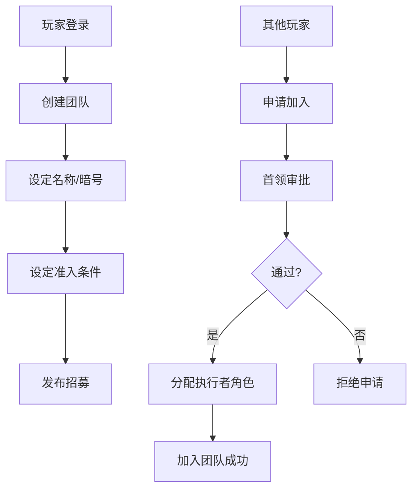
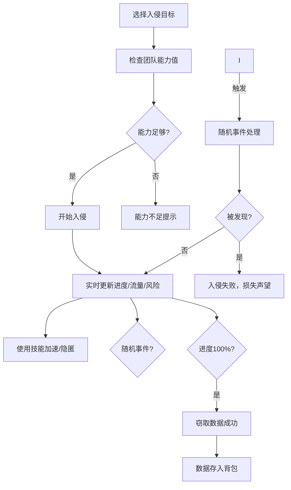
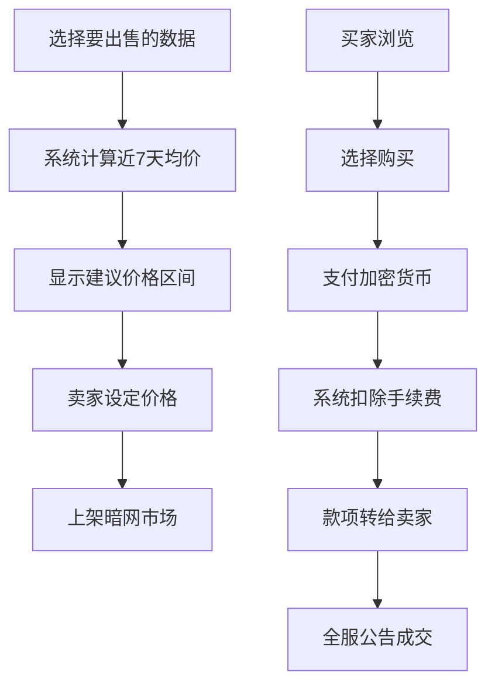
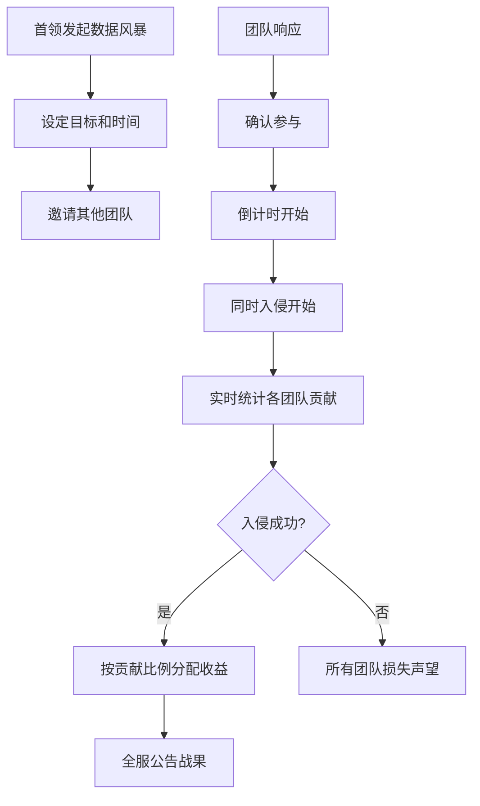

## 1. 产品概述

赛博骇客战争是一款多人在线赛博朋克风格的骇客团队入侵与数据战争模拟系统。玩家创建骇客团队，招募成员，入侵企业服务器和政府数据库，在暗网交易窃取的数据，与其他团队争夺资源和荣誉。

- 核心玩法：团队协作入侵、实时战斗系统、数据交易经济、排行榜竞技
- 目标用户：喜欢策略游戏、赛博朋克题材、多人协作竞技的玩家
- 市场价值：填补赛博朋克骇客题材多人在线策略游戏的空白

## 2. 核心功能

### 2.1 用户角色

| 角色 | 注册方式 | 核心权限 |
|------|----------|----------|
| 玩家 | 用户名注册 | 创建/加入团队、执行入侵任务、交易数据、查看排行榜 |
| 首领 | 团队创建者自动成为 | 审批新成员、发布高级入侵任务、管理团队权限、分配战利品 |
| 副手 | 首领任命 | 协助管理成员、发起普通入侵、查看团队财务 |
| 执行者 | 默认成员角色 | 执行入侵任务、使用技能、参与数据风暴行动 |

### 2.2 功能模块

1. **团队管理页**：创建团队、成员审批、权限管理、技能配置
2. **入侵中心页**：目标浏览、实时入侵、技能使用、风险控制
3. **暗网交易页**：数据上架、价格建议、交易记录、全服公告
4. **数据风暴页**：联合行动发起、团队协作、贡献统计、收益分配
5. **骇客周报页**：入侵统计、热力图、成长曲线、PDF导出
6. **排行榜页**：全服排名、团队详情、战绩查看
7. **个人中心页**：账户信息、技能升级、资产统计

### 2.3 页面详情

| 页面名称 | 模块名称 | 功能描述 |
|-----------|-------------|---------------------|
| 团队管理页 | 团队创建 | 设定团队名称、暗号、招募宣言、准入条件 |
| 团队管理页 | 成员管理 | 三级权限系统（首领/副手/执行者）、成员审批、踢出成员 |
| 团队管理页 | 技能面板 | 显示成员破解/编程/隐匿技能值，自动计算团队入侵能力值 |
| 入侵中心页 | 目标列表 | 企业服务器、政府数据库，显示防火墙等级、反追踪系统、警报概率 |
| 入侵中心页 | 实时入侵 | 破解进度条、剩余流量显示、被发现风险、技能加速/隐匿按钮 |
| 入侵中心页 | 随机事件 | 漏洞发现、反骇客攻击、系统崩溃等随机事件触发 |
| 暗网交易页 | 数据上架 | 窃取数据分类展示、卖家定价、系统建议价格区间（近7天均价） |
| 暗网交易页 | 交易市场 | 数据浏览、购买、成交全服公告滚动显示 |
| 数据风暴页 | 行动大厅 | 发起/加入联合入侵、显示参与团队、目标信息 |
| 数据风暴页 | 贡献系统 | 实时贡献统计、按贡献比例分配收益 |
| 骇客周报页 | 数据统计 | 入侵成功率、目标热力图、团队成长曲线 |
| 骇客周报页 | PDF导出 | 生成含雷达图和趋势图的周报PDF |
| 排行榜页 | 排名展示 | 总入侵点数、财富、团队等级三类排行榜 |
| 排行榜页 | 团队详情 | 查看他人团队配置、成员技能、历史战绩 |
| 个人中心页 | 账户管理 | 头像、昵称、技能升级、资产查看 |

## 3. 核心流程

### 3.1 团队创建与成员加入流程

### 3.2 入侵任务执行流程

### 3.3 暗网交易流程

### 3.4 数据风暴联合入侵流程

## 4. 用户界面设计

### 4.1 设计风格

**赛博朋克霓虹风格**
- 主色调：深邃黑 (#0a0a0f) 为背景，霓虹青 (#00f5ff) 为主色，霓虹品红 (#ff00ff) 为辅色
- 警示色：危险红 (#ff3366)、成功绿 (#00ff88)、警告黄 (#ffaa00)
- 按钮风格：锐利切角、霓虹发光边框、悬停时脉冲光效
- 字体：显示字体使用 Orbitron（科技感），正文字体使用 JetBrains Mono（等宽代码风）
- 布局风格：深色背景 + 霓虹发光元素 + 网格线纹理 + 故障艺术效果
- 图标风格：线性发光图标，配合数据流动效

### 4.2 页面设计概述

| 页面名称 | 模块名称 | UI元素 |
|-----------|-------------|-------------|
| 团队管理页 | 团队头部 | 霓虹发光团队名牌、暗号加密显示、成员数量统计、能力值雷达图 |
| 团队管理页 | 成员列表 | 卡片式布局，成员头像带霓虹边框，技能条发光显示，权限徽章 |
| 入侵中心页 | 目标地图 | 赛博风格城市地图，目标点闪烁发光，点击显示详情面板 |
| 入侵中心页 | 入侵面板 | 实时进度条带数据流效果，风险指示器颜色渐变，技能按钮带冷却动画 |
| 暗网交易页 | 数据列表 | 数据卡片带扫描线效果，价格建议高亮显示，成交记录滚动动画 |
| 数据风暴页 | 行动大厅 | 大型倒计时计时器，参与团队进度条并排显示，贡献值实时跳动 |
| 骇客周报页 | 统计面板 | 雷达图发光效果，热力图动态渲染，导出按钮带粒子效果 |
| 排行榜页 | 排名列表 | 前三名带特殊霓虹光晕，排名变化箭头动画，点击展开详情 |

### 4.3 响应式设计

- 桌面端：1920px 优先，三栏布局（导航 + 主内容 + 实时信息侧边栏）
- 平板端：两栏布局，侧边栏可折叠
- 移动端：单栏布局，底部导航，手势操作优化
- 所有数据可视化图表自适应容器大小
- 触摸目标最小 48x48px，适配触控操作

### 4.4 视觉特效

- 背景：深色渐变 + 网格线纹理 + 轻微噪点
- 发光效果：text-shadow 和 box-shadow 实现霓虹发光
- 动画：数据流动画、扫描线效果、故障艺术闪烁、加载骨架屏
- 交互：悬停时发光增强，点击时微缩放反馈，页面切换渐入渐出
- 状态指示：风险等级通过颜色渐变（绿→黄→红）直观显示
