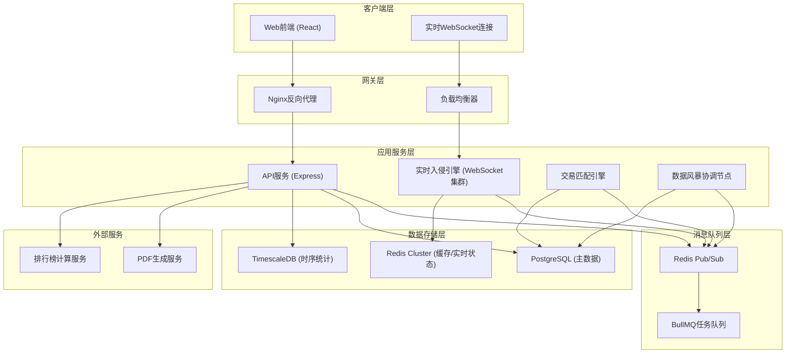
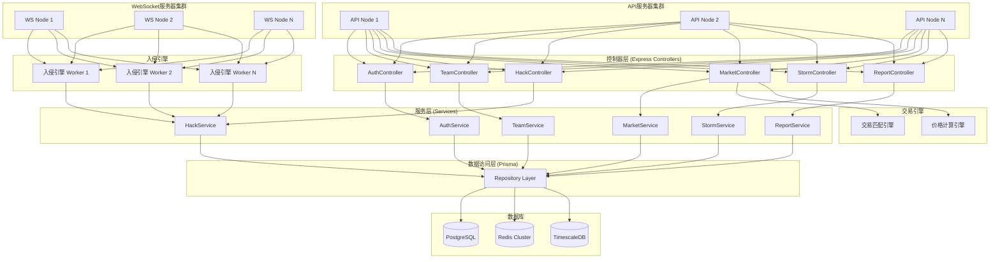
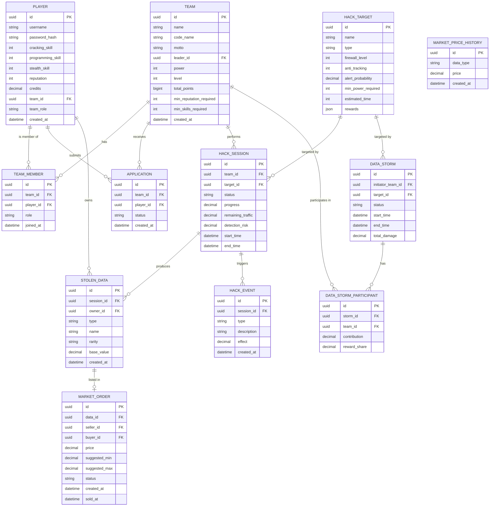

## 1. 架构设计



## 2. 技术描述

### 2.1 前端技术栈
- **框架**: React@18 + TypeScript
- **构建工具**: Vite@5
- **样式**: TailwindCSS@3
- **状态管理**: Zustand
- **路由**: React Router v6
- **图表库**: Recharts (雷达图、趋势图、热力图)
- **WebSocket**: Socket.IO Client
- **PDF生成**: jspdf + html2canvas
- **图标**: lucide-react
- **动画**: Framer Motion

### 2.2 后端技术栈
- **框架**: Express@4 + TypeScript
- **实时通信**: Socket.IO (集群模式)
- **数据库**: PostgreSQL@15 + Redis@7 + TimescaleDB
- **ORM**: Prisma
- **任务队列**: BullMQ
- **认证**: JWT + bcrypt
- **验证**: Zod
- **日志**: Winston

### 2.3 关键技术决策
1. **WebSocket集群**: 使用 Redis Adapter 实现 Socket.IO 多节点部署，支持数千并发连接
2. **事件驱动架构**: 入侵事件、交易事件通过 Redis Pub/Sub 广播，解耦各服务
3. **时序数据库**: TimescaleDB 存储入侵统计数据，支持高效的周报聚合查询
4. **缓存策略**: 热点数据（排行榜、在线状态、实时入侵进度）全量缓存到 Redis
5. **限流保护**: API 网关实现基于令牌桶的限流，防止 DDoS 攻击

## 3. 路由定义

| 路由 | 页面/接口 | 权限要求 |
|-------|---------|----------|
| / | 首页/登录 | 公开 |
| /dashboard | 主控台 | 已登录 |
| /team | 团队管理 | 已登录 |
| /team/create | 创建团队 | 已登录无团队 |
| /hack | 入侵中心 | 已登录有团队 |
| /market | 暗网交易 | 已登录 |
| /storm | 数据风暴 | 已登录有团队 |
| /weekly | 骇客周报 | 已登录 |
| /ranking | 排行榜 | 已登录 |
| /profile | 个人中心 | 已登录 |

## 4. API 定义

### 4.1 类型定义

```typescript
// 玩家信息
interface Player {
  id: string;
  username: string;
  avatar: string;
  skills: {
    cracking: number;    // 破解 0-100
    programming: number; // 编程 0-100
    stealth: number;     // 隐匿 0-100
  };
  reputation: number;    // 声望
  credits: number;       // 加密货币
  teamId: string | null;
  teamRole: 'leader' | 'officer' | 'operator' | null;
  createdAt: Date;
}

// 团队信息
interface Team {
  id: string;
  name: string;
  codeName: string;      // 暗号
  motto: string;         // 招募宣言
  leaderId: string;
  members: TeamMember[];
  power: number;         // 团队入侵能力值
  level: number;
  totalPoints: number;   // 总入侵点数
  joinCondition: {
    minReputation: number;
    minSkills: number;
  };
  pendingApplications: Application[];
  createdAt: Date;
}

interface TeamMember {
  playerId: string;
  username: string;
  avatar: string;
  role: 'leader' | 'officer' | 'operator';
  skills: Player['skills'];
  joinedAt: Date;
}

// 入侵目标
interface HackTarget {
  id: string;
  name: string;
  type: 'corporate' | 'government';
  description: string;
  firewallLevel: number;    // 1-10
  antiTracking: number;     // 1-10
  alertProbability: number; // 0-1
  minPowerRequired: number;
  rewards: {
    dataTypes: string[];
    minCredits: number;
    maxCredits: number;
    points: number;
  };
  estimatedTime: number;    // 秒
}

// 入侵会话
interface HackSession {
  id: string;
  teamId: string;
  targetId: string;
  status: 'hacking' | 'success' | 'failed' | 'detected';
  progress: number;         // 0-100
  remainingTraffic: number; // 0-100
  detectionRisk: number;    // 0-100
  startTime: Date;
  activeSkills: ActiveSkill[];
  events: HackEvent[];
  dataStolen: StolenData[];
}

// 被盗数据
interface StolenData {
  id: string;
  type: string;
  name: string;
  rarity: 'common' | 'rare' | 'epic' | 'legendary';
  value: number;            // 系统估值
  ownerId: string;
  createdAt: Date;
}

// 交易订单
interface MarketOrder {
  id: string;
  dataId: string;
  data: StolenData;
  sellerId: string;
  sellerName: string;
  price: number;
  suggestedPriceRange: [number, number];
  status: 'listed' | 'sold' | 'cancelled';
  createdAt: Date;
  soldAt?: Date;
  buyerId?: string;
}

// 数据风暴行动
interface DataStorm {
  id: string;
  initiatorTeamId: string;
  targetId: string;
  status: 'recruiting' | 'countdown' | 'active' | 'completed' | 'failed';
  participantTeams: StormParticipant[];
  startTime: Date;
  endTime?: Date;
  totalDamage: number;
  rewards: StormReward[];
}

interface StormParticipant {
  teamId: string;
  teamName: string;
  contribution: number;
  players: string[];
}
```

### 4.2 核心API接口

| 方法 | 路径 | 描述 | 请求体 | 响应体 |
|------|------|------|--------|--------|
| POST | /api/auth/login | 登录 | { username, password } | { token, player } |
| POST | /api/auth/register | 注册 | { username, password } | { token, player } |
| GET | /api/team | 获取团队信息 | - | Team |
| POST | /api/team | 创建团队 | { name, codeName, motto, joinCondition } | Team |
| POST | /api/team/applications | 申请加入团队 | { teamId } | Application |
| POST | /api/team/applications/:id/approve | 审批申请 | { approve, role? } | TeamMember |
| PUT | /api/team/members/:playerId/role | 更改成员角色 | { role } | TeamMember |
| GET | /api/hack/targets | 获取入侵目标列表 | - | HackTarget[] |
| POST | /api/hack/start | 开始入侵 | { targetId } | HackSession |
| GET | /api/hack/sessions/:id | 获取入侵会话 | - | HackSession |
| POST | /api/hack/sessions/:id/skill | 使用技能 | { skillType } | HackSession |
| GET | /api/market/orders | 获取市场订单 | - | MarketOrder[] |
| POST | /api/market/list | 上架数据 | { dataId, price } | MarketOrder |
| POST | /api/market/buy/:id | 购买数据 | - | { success, data } |
| GET | /api/market/price-suggestion/:dataId | 获取价格建议 | - | { avg7d, range: [min, max] } |
| GET | /api/storm/active | 获取活跃数据风暴 | - | DataStorm[] |
| POST | /api/storm/create | 创建数据风暴 | { targetId } | DataStorm |
| POST | /api/storm/:id/join | 加入数据风暴 | - | DataStorm |
| GET | /api/weekly | 获取骇客周报 | - | WeeklyReport |
| GET | /api/weekly/export | 导出PDF | - | PDF Buffer |
| GET | /api/ranking | 获取排行榜 | { type: 'points' \| 'wealth' \| 'level' } | RankEntry[] |

### 4.3 WebSocket事件

| 事件名 | 方向 | 描述 | 数据 |
|--------|------|------|------|
| hack:update | 服务端→客户端 | 入侵进度更新 | { sessionId, progress, risk, traffic } |
| hack:event | 服务端→客户端 | 随机事件触发 | { sessionId, event: HackEvent } |
| hack:complete | 服务端→客户端 | 入侵完成 | { sessionId, success, rewards } |
| market:announce | 服务端→客户端 | 全服交易公告 | { order, buyerName, sellerName } |
| storm:update | 服务端→客户端 | 数据风暴更新 | { stormId, participants, totalDamage } |
| storm:complete | 服务端→客户端 | 数据风暴结束 | { stormId, success, rewards } |

## 5. 服务器架构图



## 6. 数据模型

### 6.1 ER图



### 6.2 DDL 语句

```sql
-- 玩家表
CREATE TABLE players (
    id UUID PRIMARY KEY DEFAULT gen_random_uuid(),
    username VARCHAR(50) UNIQUE NOT NULL,
    password_hash VARCHAR(255) NOT NULL,
    avatar VARCHAR(255) DEFAULT 'default.png',
    cracking_skill INTEGER DEFAULT 10 CHECK (cracking_skill BETWEEN 0 AND 100),
    programming_skill INTEGER DEFAULT 10 CHECK (programming_skill BETWEEN 0 AND 100),
    stealth_skill INTEGER DEFAULT 10 CHECK (stealth_skill BETWEEN 0 AND 100),
    reputation INTEGER DEFAULT 0,
    credits DECIMAL(18, 2) DEFAULT 1000.00,
    team_id UUID REFERENCES teams(id) ON DELETE SET NULL,
    team_role VARCHAR(20) CHECK (team_role IN ('leader', 'officer', 'operator')),
    created_at TIMESTAMPTZ DEFAULT NOW()
);

CREATE INDEX idx_players_team_id ON players(team_id);
CREATE INDEX idx_players_username ON players(username);

-- 团队表
CREATE TABLE teams (
    id UUID PRIMARY KEY DEFAULT gen_random_uuid(),
    name VARCHAR(50) UNIQUE NOT NULL,
    code_name VARCHAR(100) NOT NULL,
    motto TEXT,
    leader_id UUID REFERENCES players(id) NOT NULL,
    power INTEGER DEFAULT 0,
    level INTEGER DEFAULT 1,
    total_points BIGINT DEFAULT 0,
    min_reputation_required INTEGER DEFAULT 0,
    min_skills_required INTEGER DEFAULT 0,
    created_at TIMESTAMPTZ DEFAULT NOW()
);

CREATE INDEX idx_teams_leader_id ON teams(leader_id);
CREATE INDEX idx_teams_power ON teams(power DESC);

-- 团队成员表
CREATE TABLE team_members (
    id UUID PRIMARY KEY DEFAULT gen_random_uuid(),
    team_id UUID REFERENCES teams(id) ON DELETE CASCADE NOT NULL,
    player_id UUID REFERENCES players(id) ON DELETE CASCADE NOT NULL,
    role VARCHAR(20) NOT NULL CHECK (role IN ('leader', 'officer', 'operator')),
    joined_at TIMESTAMPTZ DEFAULT NOW(),
    UNIQUE(team_id, player_id)
);

-- 入队申请表
CREATE TABLE applications (
    id UUID PRIMARY KEY DEFAULT gen_random_uuid(),
    team_id UUID REFERENCES teams(id) ON DELETE CASCADE NOT NULL,
    player_id UUID REFERENCES players(id) ON DELETE CASCADE NOT NULL,
    status VARCHAR(20) NOT NULL DEFAULT 'pending' CHECK (status IN ('pending', 'approved', 'rejected')),
    message TEXT,
    created_at TIMESTAMPTZ DEFAULT NOW()
);

CREATE INDEX idx_applications_team_status ON applications(team_id, status);

-- 入侵目标表
CREATE TABLE hack_targets (
    id UUID PRIMARY KEY DEFAULT gen_random_uuid(),
    name VARCHAR(100) NOT NULL,
    type VARCHAR(20) NOT NULL CHECK (type IN ('corporate', 'government')),
    description TEXT,
    firewall_level INTEGER NOT NULL CHECK (firewall_level BETWEEN 1 AND 10),
    anti_tracking INTEGER NOT NULL CHECK (anti_tracking BETWEEN 1 AND 10),
    alert_probability DECIMAL(5,4) NOT NULL CHECK (alert_probability BETWEEN 0 AND 1),
    min_power_required INTEGER NOT NULL,
    estimated_time INTEGER NOT NULL,
    rewards JSONB NOT NULL,
    created_at TIMESTAMPTZ DEFAULT NOW()
);

-- 入侵会话表
CREATE TABLE hack_sessions (
    id UUID PRIMARY KEY DEFAULT gen_random_uuid(),
    team_id UUID REFERENCES teams(id) ON DELETE CASCADE NOT NULL,
    target_id UUID REFERENCES hack_targets(id) NOT NULL,
    status VARCHAR(20) NOT NULL DEFAULT 'hacking' CHECK (status IN ('hacking', 'success', 'failed', 'detected')),
    progress DECIMAL(5,2) DEFAULT 0 CHECK (progress BETWEEN 0 AND 100),
    remaining_traffic DECIMAL(5,2) DEFAULT 100 CHECK (remaining_traffic BETWEEN 0 AND 100),
    detection_risk DECIMAL(5,2) DEFAULT 0 CHECK (detection_risk BETWEEN 0 AND 100),
    start_time TIMESTAMPTZ DEFAULT NOW(),
    end_time TIMESTAMPTZ
);

CREATE INDEX idx_hack_sessions_active ON hack_sessions(status) WHERE status = 'hacking';
CREATE INDEX idx_hack_sessions_team ON hack_sessions(team_id);

-- 入侵事件表
CREATE TABLE hack_events (
    id UUID PRIMARY KEY DEFAULT gen_random_uuid(),
    session_id UUID REFERENCES hack_sessions(id) ON DELETE CASCADE NOT NULL,
    type VARCHAR(50) NOT NULL,
    description TEXT NOT NULL,
    effect DECIMAL(10,2) NOT NULL,
    is_positive BOOLEAN NOT NULL,
    created_at TIMESTAMPTZ DEFAULT NOW()
);

-- 被盗数据表
CREATE TABLE stolen_data (
    id UUID PRIMARY KEY DEFAULT gen_random_uuid(),
    session_id UUID REFERENCES hack_sessions(id) ON DELETE SET NULL,
    owner_id UUID REFERENCES players(id) ON DELETE CASCADE NOT NULL,
    type VARCHAR(50) NOT NULL,
    name VARCHAR(100) NOT NULL,
    rarity VARCHAR(20) NOT NULL CHECK (rarity IN ('common', 'rare', 'epic', 'legendary')),
    base_value DECIMAL(18, 2) NOT NULL,
    created_at TIMESTAMPTZ DEFAULT NOW()
);

CREATE INDEX idx_stolen_data_owner ON stolen_data(owner_id);
CREATE INDEX idx_stolen_data_rarity ON stolen_data(rarity);

-- 市场订单表
CREATE TABLE market_orders (
    id UUID PRIMARY KEY DEFAULT gen_random_uuid(),
    data_id UUID REFERENCES stolen_data(id) ON DELETE CASCADE NOT NULL,
    seller_id UUID REFERENCES players(id) ON DELETE CASCADE NOT NULL,
    buyer_id UUID REFERENCES players(id) ON DELETE SET NULL,
    price DECIMAL(18, 2) NOT NULL,
    suggested_min DECIMAL(18, 2) NOT NULL,
    suggested_max DECIMAL(18, 2) NOT NULL,
    status VARCHAR(20) NOT NULL DEFAULT 'listed' CHECK (status IN ('listed', 'sold', 'cancelled')),
    created_at TIMESTAMPTZ DEFAULT NOW(),
    sold_at TIMESTAMPTZ
);

CREATE INDEX idx_market_orders_status ON market_orders(status) WHERE status = 'listed';
CREATE INDEX idx_market_orders_price ON market_orders(price);

-- 市场价格历史表 (TimescaleDB 超表)
CREATE TABLE market_price_history (
    id UUID PRIMARY KEY DEFAULT gen_random_uuid(),
    data_type VARCHAR(50) NOT NULL,
    price DECIMAL(18, 2) NOT NULL,
    created_at TIMESTAMPTZ DEFAULT NOW() NOT NULL
);

SELECT create_hypertable('market_price_history', 'created_at');
CREATE INDEX idx_price_history_type_time ON market_price_history(data_type, created_at DESC);

-- 数据风暴表
CREATE TABLE data_storms (
    id UUID PRIMARY KEY DEFAULT gen_random_uuid(),
    initiator_team_id UUID REFERENCES teams(id) NOT NULL,
    target_id UUID REFERENCES hack_targets(id) NOT NULL,
    status VARCHAR(20) NOT NULL DEFAULT 'recruiting' CHECK (status IN ('recruiting', 'countdown', 'active', 'completed', 'failed')),
    start_time TIMESTAMPTZ DEFAULT NOW(),
    end_time TIMESTAMPTZ,
    total_damage DECIMAL(18, 2) DEFAULT 0
);

CREATE INDEX idx_data_storms_active ON data_storms(status) WHERE status IN ('recruiting', 'countdown', 'active');

-- 数据风暴参与表
CREATE TABLE data_storm_participants (
    id UUID PRIMARY KEY DEFAULT gen_random_uuid(),
    storm_id UUID REFERENCES data_storms(id) ON DELETE CASCADE NOT NULL,
    team_id UUID REFERENCES teams(id) ON DELETE CASCADE NOT NULL,
    contribution DECIMAL(18, 2) DEFAULT 0,
    reward_share DECIMAL(5, 2) DEFAULT 0,
    joined_at TIMESTAMPTZ DEFAULT NOW(),
    UNIQUE(storm_id, team_id)
);

-- 初始化入侵目标数据
INSERT INTO hack_targets (name, type, description, firewall_level, anti_tracking, alert_probability, min_power_required, estimated_time, rewards) VALUES
('赛博娱乐集团用户数据库', 'corporate', '包含200万用户个人信息和消费记录', 3, 2, 0.15, 150, 120, '{"dataTypes": ["user_profiles", "payment_records"], "minCredits": 5000, "maxCredits": 15000, "points": 100}'),
('荒坂科技研发服务器', 'corporate', '最新义体技术研发资料，高度保密', 8, 7, 0.45, 500, 300, '{"dataTypes": ["tech_blueprints", "research_data"], "minCredits": 50000, "maxCredits": 150000, "points": 500}'),
('夜之城市民信息库', 'government', '全市居民身份、医疗、教育记录', 6, 5, 0.35, 350, 240, '{"dataTypes": ["citizen_records", "health_data"], "minCredits": 25000, "maxCredits": 75000, "points": 300}'),
('NCPD警用通讯系统', 'government', '实时通讯监听和案件档案', 7, 6, 0.40, 420, 280, '{"dataTypes": ["police_intel", "case_files"], "minCredits": 35000, "maxCredits": 100000, "points": 400}'),
('媒体集团新闻资料库', 'corporate', '未公开的新闻素材和机密采访记录', 5, 4, 0.25, 280, 180, '{"dataTypes": ["unpublished_news", "source_records"], "minCredits": 15000, "maxCredits": 45000, "points": 250}'),
('军用科技武器系统', 'corporate', '下一代武器系统设计文档和测试数据', 9, 8, 0.55, 650, 360, '{"dataTypes": ["weapon_specs", "military_intel"], "minCredits": 100000, "maxCredits": 300000, "points": 750}'),
('税务总局金融数据库', 'government', '企业和个人税务记录，洗钱线索', 8, 7, 0.50, 550, 320, '{"dataTypes": ["financial_records", "tax_data"], "minCredits": 60000, "maxCredits": 180000, "points": 600}');
```
